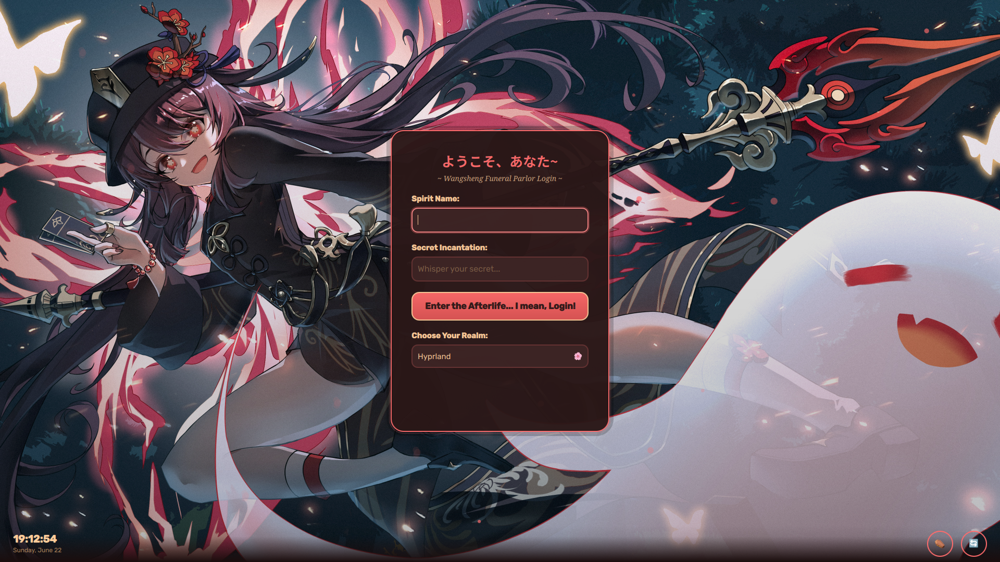
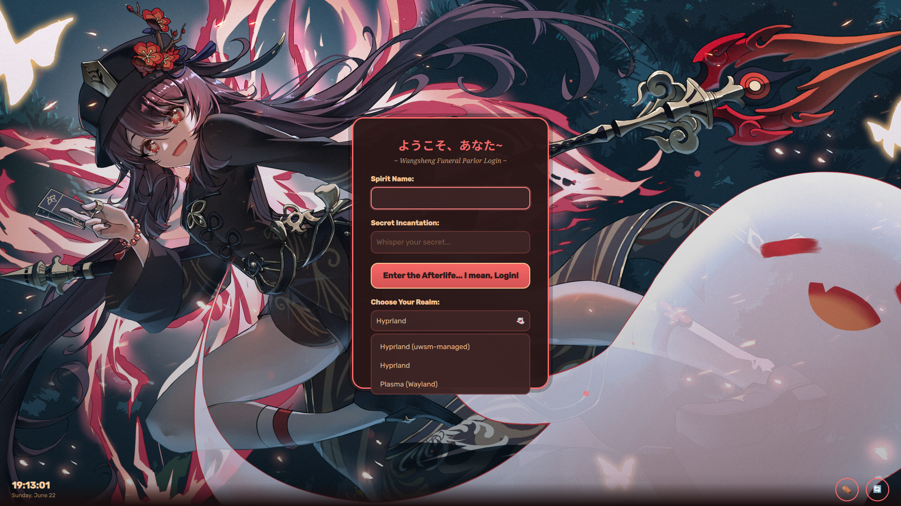

# hu-tao-sddm-theme 🔥

A beautiful **SDDM** (Simple Desktop Display Manager) login theme inspired by Hu Tao from Genshin Impact, featuring elegant dark aesthetics with fiery accents and smooth animations.



## ✨ Features

- **Hu Tao Inspired Design** - Beautiful artwork and color scheme matching Hu Tao's aesthetic
- **Smooth Animations** - Elegant transitions and hover effects
- **Custom Backgrounds** - High-quality Hu Tao artwork from [Hyacinthsora](https://www.pixiv.net/en/users/15748136)
- **Dark Theme** - Easy on the eyes with warm accent colors
- **Session Selection** - Support for multiple desktop environments
- **Password Visibility Toggle** - Show/hide password option
- **Modern UI Elements** - Clean, minimalist interface design

## 🖼️ Screenshots

| Login Screen | Session Selection |
|:------------:|:-----------------:|
|  |  |

## 📋 Requirements

- **SDDM** - Simple Desktop Display Manager
- **Qt6** - Required for SDDM themes
- **Linux Distribution** with systemd (most modern distros)

### Install SDDM (if not already installed):

**Ubuntu/Debian:**
```bash
sudo apt update
sudo apt install sddm
```

**Arch Linux:**
```bash
sudo pacman -S sddm
```

**Fedora:**
```bash
sudo dnf install sddm
```

**openSUSE:**
```bash
sudo zypper install sddm
```

## 🚀 Installation

### Automatic Installation

1. **Clone the repository:**
   ```bash
   git clone https://github.com/SlackerBahadir/hu-tao-sddm-theme.git
   cd hutao-sddm-theme
   ```

2. **Run the installation script:**
   ```bash
   chmod +x install.sh
   sudo ./install.sh
   ```

3. **Log out or reboot** to see your new theme!

### Manual Installation (Recommended)

1. **Clone the repository:**
   ```bash
   git clone https://github.com/SlackerBahadir/hu-tao-sddm-theme.git
   ```

2. **Copy theme files:**
   ```bash
   sudo cp -r hu-tao-sddm-theme/ /usr/share/sddm/themes/
   ```

3. **Edit SDDM configuration:**
   ```bash
   sudo nano /etc/sddm.conf
   ```
   
   Add or modify the `[Theme]` section:
   ```ini
   [Theme]
   Current=hu-tao-sddm-theme
   ```

4. **Restart SDDM:**
   ```bash
   sudo systemctl restart sddm
   ```

## 🎨 Customization

### Changing Background

Replace the background image in the theme directory:
```bash
sudo cp your-image.jpg /usr/share/sddm/themes/hu-tao-sddm-theme/background.png
```

## 🔧 Troubleshooting

### Theme Not Appearing

1. **Check SDDM configuration:**
   ```bash
   sudo cat /etc/sddm.conf | grep Current
   ```

2. **Verify theme files exist:**
   ```bash
   ls -la /usr/share/sddm/themes/hu-tao-sddm-theme/
   ```

3. **Check SDDM service status:**
   ```bash
   sudo systemctl status sddm
   ```

### Login Issues

1. **Check SDDM logs:**
   ```bash
   sudo journalctl -u sddm -f
   ```

2. **Test theme syntax:**
   ```bash
   sddm-greeter --test-mode --theme /usr/share/sddm/themes/hu-tao-sddm-theme
   ```

### Display Problems

1. **Check Qt5 installation:**
   ```bash
   qmake --version
   ```

2. **Verify graphics drivers** are properly installed

3. **Try different display manager temporarily:**
   ```bash
   sudo systemctl disable sddm
   sudo systemctl enable lightdm  # or gdm
   ```

## 🗑️ Uninstallation

### Using the Script

```bash
sudo ./install.sh --uninstall
```

### Manual Removal

1. **Remove theme files:**
   ```bash
   sudo rm -rf /usr/share/sddm/themes/hu-tao-sddm-theme
   ```

2. **Restore SDDM configuration:**
   ```bash
   sudo cp /etc/sddm.conf.backup /etc/sddm.conf
   ```
   
   Or edit manually:
   ```bash
   sudo nano /etc/sddm.conf
   ```

3. **Restart SDDM:**
   ```bash
   sudo systemctl restart sddm
   ```

## 🤝 Contributing

Contributions are welcome! Please feel free to submit a Pull Request. For major changes, please open an issue first to discuss what you would like to change.

### Development Setup

1. Fork the repository
2. Create your feature branch (`git checkout -b feature/AmazingFeature`)
3. Test your changes with SDDM
4. Commit your changes (`git commit -m 'Add some AmazingFeature'`)
5. Push to the branch (`git push origin feature/AmazingFeature`)
6. Open a Pull Request

## 📝 License

This project is licensed under the MIT License - see the [LICENSE](LICENSE) file for details.

## 🙏 Acknowledgments

- **miHoYo/HoYoverse** - For creating Genshin Impact and the amazing character Hu Tao ❤️
- **Artwork Creator** [Hyacinthsora](https://www.pixiv.net/en/users/15748136) - For background image. THANKS!!
- **SDDM Team** - For the Simple Desktop Display Manager
- **Qt Project** - For the Qt framework
- **Community** - For feedback and contributions

## 📷 Credits

- Hu Tao artwork from [Hyacinthsora](https://www.pixiv.net/en/users/15748136)

## 📞 Support

If you encounter any issues or have questions:

1. Check the [Issues](https://github.com/SlackerBahadir/hu-tao-sddm-theme/issues) page
2. Create a new issue with detailed information
3. Include your system information and SDDM logs

---

<div align="center">

**Made with ❤️ for the Genshin Impact community**

[](https://github.com/SlackerBahadir/hu-tao-sddm-theme)
[](https://github.com/SlackerBahadir/hu-tao-sddm-theme)
[](LICENSE)

</div>